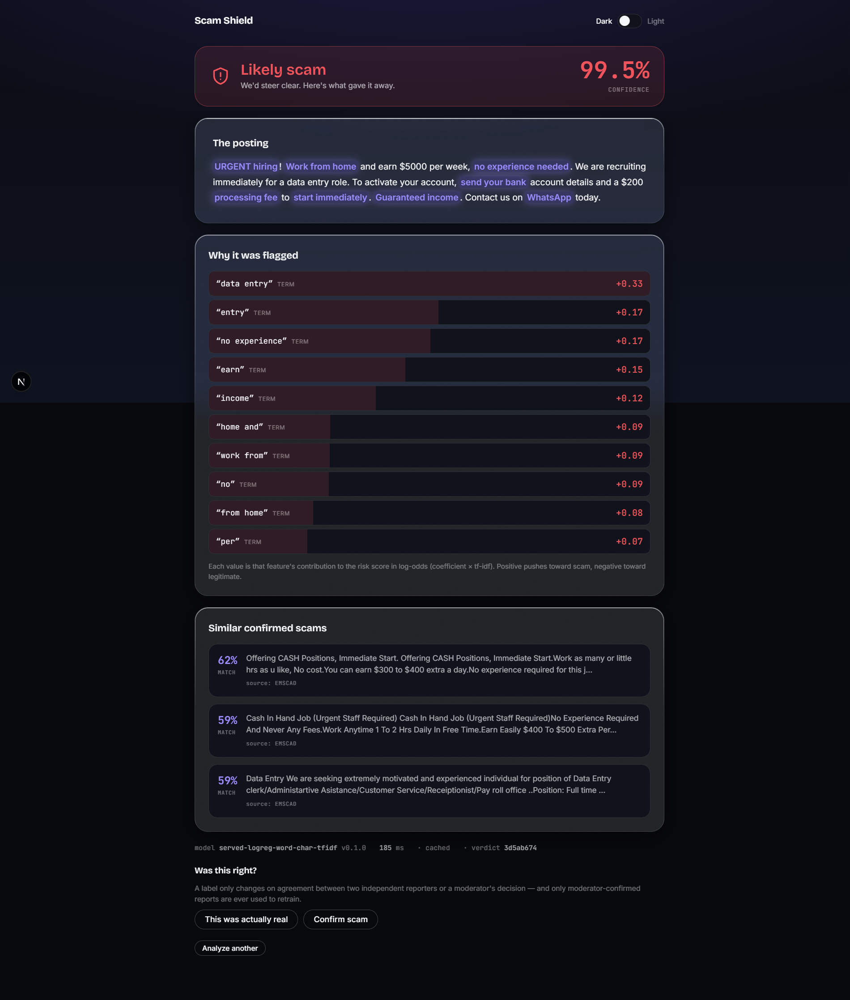

# Scam Shield

**Paste any job post or recruiter message. Find out in under a second whether it's likely a scam —
and see exactly what gave it away.**

Online recruitment fraud is real and costly. Scam Shield is a web app that flags likely-fraudulent
job postings and, critically, _shows its work_: every flag is a real feature contribution, every
number on screen traces to a computation, and the verdict is always hedged — _"Likely scam — 87%
confident"_, never _"This is a scam."_

> **Why the accuracy number isn't the point.** Only **4.84%** of real job postings are fraudulent.
> A model that says "legitimate" for _every_ posting is **95.2% accurate — and catches zero scams.**
> That is why we never headline accuracy. We report precision (of the jobs we flag, how many are
> really scams), recall (of all scams, how many we catch), and PR-AUC — and we let you move the
> decision threshold yourself to see the tradeoff between blocking real jobs and letting scams
> through.



---

## Does it work?

- **The served model loads in Java and matches the training notebook's probability within `1e-6`**
  (ONNX Runtime parity test) — the model you evaluate offline is exactly the one that runs.
- The canonical scam above scores **"Likely scam", 99.5% calibrated**, with real top features
  (`data entry`, `no experience`, `processing fee`…) and its three nearest confirmed scams from the
  EMSCAD corpus — end to end in well under two seconds.
- **28 tests pass**, including Testcontainers integration tests over Postgres + pgvector and Redis:
  the analysis pipeline, the four auth guarantees, the feedback-loop poisoning guards, and the
  threshold-slider recompute.

---

## What it does

A single paste runs a nine-step pipeline, none of it a black box:

1. **Rate limit** (Redis token bucket) → 2. **normalize + content-hash** (identical postings return
the cached verdict) → 3. **Aho-Corasick** scan of a scam-phrase registry → 4. **Levenshtein**
typosquat check on linked domains → 5. **TF-IDF → ONNX logistic regression → calibrated
probability** → 6. **contribution extraction** (`coefficient × tfidf`, the exact log-odds terms the
UI shows) → 7. **salary plausibility** (Ridge z-score) → 8. **MiniLM embedding → pgvector cosine
search** for the three nearest confirmed scams → 9. **persist + audit**.

**Why a linear model, when XGBoost scores higher?** Because for a linear model over TF-IDF, a
feature's contribution to the score is exactly `coefficient × tfidf` — computable in Java in
microseconds, and _actually true_. XGBoost and DistilBERT are trained as **challengers** and their
scores are shown on the `/model` page; they are not served because they cannot produce an honest
explanation. See [`docs/MODEL_CARD.md`](docs/MODEL_CARD.md).

---

## Metrics — baseline first

Dataset: **EMSCAD** — 17,880 job ads, **866 fraudulent (4.84%)**, English, manually annotated.
Reported on the untouched 20% test split. Primary metric: **PR-AUC**. Operating threshold chosen at
**precision ≥ 0.90** (precision-first, to avoid branding real employers as frauds).

| Model | PR-AUC | F1 | Recall @ P≥0.90 | ROC-AUC |
| --- | --- | --- | --- | --- |
| **Majority-class baseline** | **0.0484** (= prevalence) | **0.0000** | **0.0000** | 0.5000 |
| Calibrated LogReg (served) | see `ml/README.md` | ← | ← | ← |
| XGBoost / DistilBERT (challengers) | see `ml/README.md` | ← | ← | ← |

The baseline row is the honest floor: **zero scams caught at 95.2% accuracy.** The served and
challenger rows are **produced by running `ml/notebooks/02_train_classifier.ipynb`** and reported in
[`ml/README.md`](ml/README.md) — intentionally not hard-coded in prose, because every number must
trace to a computation. The live **`/model`** page recomputes precision, recall, "real jobs blocked"
(false positives) and "scams let through" (false negatives) from the model's stored held-out
predictions as you drag the threshold, alongside the PR curve, ROC curve, and calibration plot.

---

## Transparency & community

- **`/model`** — PR curve, ROC, calibration, confusion matrix, and a **threshold slider** that
  recomputes all four error numbers live from stored predictions.
- **`/trends`** — which scam patterns are rising, aggregated from real verdict features.
- **`/campaigns`** — Union-Find clustering of near-duplicate postings: the same scam reposted under
  many company names.
- **Reports & moderation** — users can dispute a verdict. The feedback loop is treated as an attack
  surface: reports require an account ≥ 7 days old, a label changes only on two independent reporters
  or an admin's decision, and **retraining reads only admin-confirmed reports.** See
  [`docs/SECURITY.md`](docs/SECURITY.md).

---

## Tech

- **Backend (the mass of the project):** Java 21, Spring Boot 3, Spring Security, Spring Data JPA,
  Flyway, **ONNX Runtime for Java** (in-process inference — no Python at request time). PostgreSQL +
  **pgvector**, Redis. Deploys to Hugging Face Spaces (Docker SDK).
- **Frontend:** Next.js 15 (App Router) + TypeScript, Tailwind v4, **Radix UI primitives** (every
  component hand-styled — no component library, no third-party auth UI), Framer Motion, GSAP on the
  landing page only, Recharts on `/model`. Deploys to Vercel.
- **ML (offline, once):** scikit-learn, XGBoost, `sentence-transformers`, exported to ONNX. Kaggle
  notebooks in [`ml/`](ml/).

---

## Run it locally

You need Docker (for Postgres + pgvector and Redis), Java 21, and Node 20+.

```bash
# 1. Data stores
docker run -d --name ss-pg -e POSTGRES_USER=scamshield -e POSTGRES_PASSWORD=scamshield \
  -e POSTGRES_DB=scamshield -p 5432:5432 pgvector/pgvector:pg16
docker run -d --name ss-redis -p 6379:6379 redis:7-alpine

# 2. Backend (Flyway applies the schema on startup). JWT_SECRET is required — no default.
#    The app listens on SERVER_PORT (default 7860).
JWT_SECRET=local-dev-only-jwt-secret-0123456789abcdef \
CORS_ALLOWED_ORIGIN=http://localhost:3000 \
  ./backend/gradlew -p backend bootRun
# → http://localhost:7860/actuator/health

# 3. Seed the confirmed-scam corpus (for the "similar scams" panel)
docker exec -i ss-pg psql -U scamshield -d scamshield < ml/out/known_scams_seed.sql

# 4. Frontend
npm --prefix frontend install
npm --prefix frontend run dev
# → http://localhost:3000
```

To populate `/model` with the real EMSCAD test-split numbers, run `ml/notebooks/02` and load the
`validation_predictions_seed.sql` it produces (after Flyway `V4`). Until then `/model` honestly
shows a "predictions not loaded" state rather than an invented curve.

**Tests:** `./backend/gradlew -p backend test` (needs Docker for Testcontainers).

## Deploy

The API deploys to a **Hugging Face Space (Docker SDK)** and the frontend to **Vercel**.

The repo root is the Space: its `README.md` header configures the Space, and its `Dockerfile`
builds the backend and exposes port **7860** (`app_port`). Set these under the Space's
**Settings → Variables and secrets**:

- **Runtime** (env vars): `SPRING_DATASOURCE_URL`, `SPRING_DATASOURCE_USERNAME`,
  `SPRING_DATASOURCE_PASSWORD` (Neon/Supabase), `SPRING_DATA_REDIS_URL` (Upstash, optional),
  `JWT_SECRET`, `CORS_ALLOWED_ORIGIN` (your Vercel origin). See [`.env.example`](.env.example).
- **Build-time** (Variable): `EMBEDDING_MODEL_URL` — the URL the build fetches the ~90 MB MiniLM
  model from. It is **not committed**; the Docker build downloads it into `EMBEDDING_MODEL_PATH`
  (default `/app/models/minilm.onnx`).

The frontend points at the Space with `NEXT_PUBLIC_API_BASE_URL`. The live URL will land here once
the Space is up; until then the "Run it locally" steps above bring the full app up in a few minutes.

---

## Docs

- [`docs/MODEL_CARD.md`](docs/MODEL_CARD.md) — what the model does, measured performance, known
  failure modes, and who it could harm if wrong.
- [`docs/SECURITY.md`](docs/SECURITY.md) — the auth design and the feedback-loop poisoning guards.
- [`ml/README.md`](ml/README.md) — the metrics table, calibration plot, and reproduction steps.
